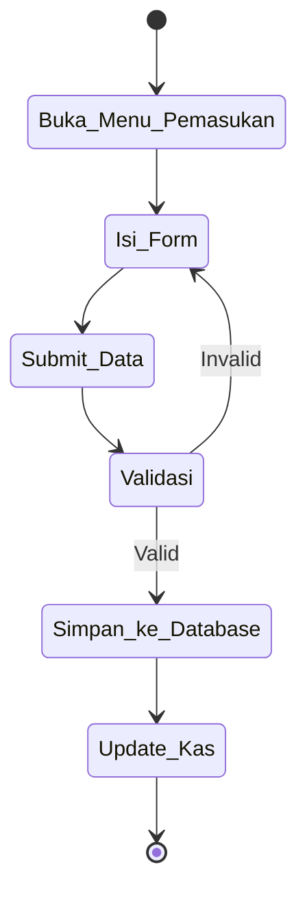
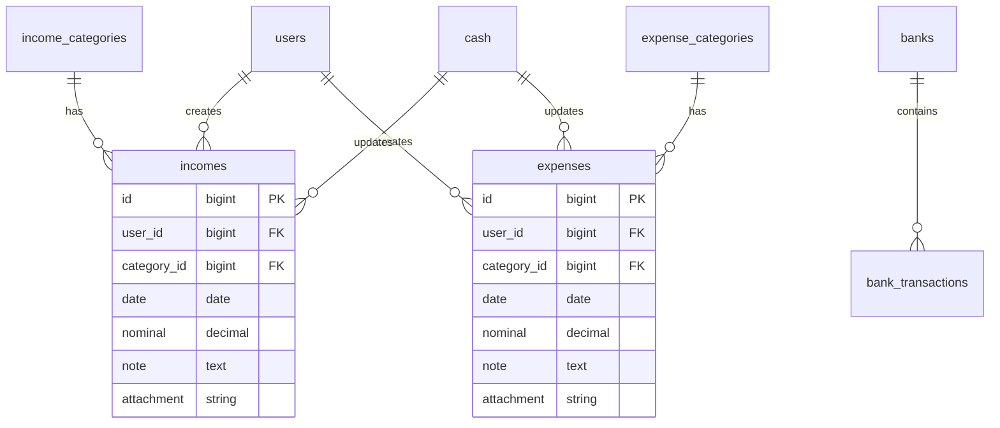

# Analisis Kebutuhan dan Desain Sistem

## 1. Analisis Kebutuhan Sistem
Aplikasi **Manajemen Pembukuan Usaha** dirancang untuk membantu UMKM.
- **Kebutuhan Fungsional:**
  - Login dan Manajemen Role (Owner, Admin, Staff)
  - Dashboard Interaktif (Chart.js, Saldo Kas, Total Pemasukan/Pengeluaran, Laba Bersih)
  - Pencatatan Pemasukan & Pengeluaran dengan bukti upload
  - Manajemen Kategori
  - Pencatatan Hutang & Piutang
  - Pengelolaan Kas & Bank
  - Laporan Keuangan (Harian, Mingguan, Bulanan, Tahunan) & Export (PDF, Excel)
  - Pengaturan Perusahaan & Activity Logs

- **Kebutuhan Non-Fungsional:**
  - Keamanan (CSRF, Hashing, Validation)
  - Performa (AJAX, DataTables)
  - UI/UX (AdminLTE 4, Bootstrap 5, Dark Mode, Responsive)

## 2. Use Case Diagram
```mermaid
usecaseDiagram
    actor Owner
    actor Admin
    actor Staff

    usecase "Login & Logout" as UC1
    usecase "Dashboard & Grafik" as UC2
    usecase "Kelola Transaksi" as UC3
    usecase "Kelola Laporan" as UC4
    usecase "Pengaturan Usaha" as UC5
    usecase "Manajemen User" as UC6

    Owner --> UC1
    Owner --> UC2
    Owner --> UC3
    Owner --> UC4
    Owner --> UC5
    Owner --> UC6

    Admin --> UC1
    Admin --> UC2
    Admin --> UC3
    Admin --> UC4

    Staff --> UC1
    Staff --> UC2
    Staff --> UC3
```

## 3. Activity Diagram (Pencatatan Pemasukan)


## 4. ERD Database & 5. Relasi Tabel

